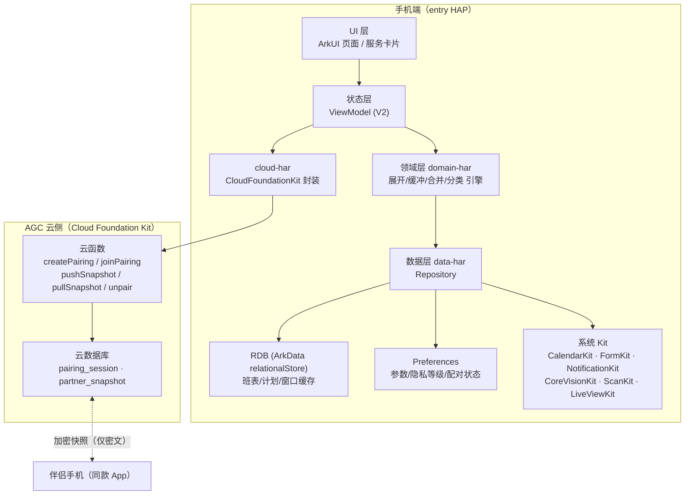
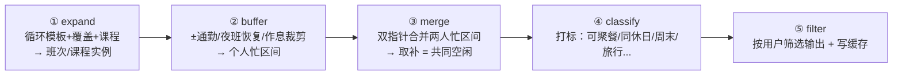
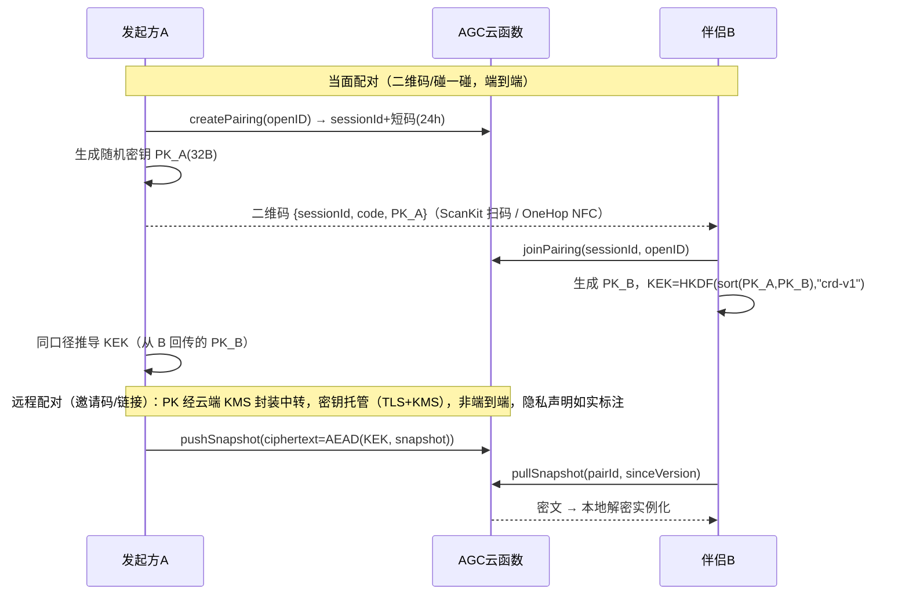

# 同休日 技术架构设计

| 项 | 内容 |
|----|------|
| 版本 | v1.1 |
| 日期 | 2026-09-15（v1.0 定稿于 2026-09-13） |
| 工程 | CommonRestday（HarmonyOS NEXT，API 21 / 6.0.1，Stage 模型，ArkTS） |
| 配套 | [产品设计文档](./01-产品设计文档.md) · [功能链路设计](./03-功能链路设计.md) |

> **v1.1 修订**：① 数据模型增加 `owner` 维度支持本机代录双人模式（PRD F2.0）；② 引擎输入支持"伴侣本机课表"路径（与快照路径二选一）；③ STUDY 标签判定明确化；④ 云端相关设计标注"AGC 就绪后生效，未就绪降级本机代录"。

---

## 1. 工程现状与选型基线

- 现有工程：DevEco 标准模板，单 `entry` 模块（`mainElement: EntryAbility`），`targetSdkVersion/compatibleSdkVersion: 6.0.1(21)`，`deviceTypes: ["phone"]`，含 backup ExtensionAbility。bundleName `com.huawei.commonrestday`。
- 语言：ArkTS + ArkUI 声明式；状态管理采用 **V2**（`@ObservedV2/@Trace/@Local`）。
- 不引入三方重依赖；JSON/时间处理用自带能力，必要时引 `@ohos` 社区轻库。
- 模块策略：**单 HAP + 分层 HAR**（1 人开发，避免多 HAP/多 bean 过度工程化）；二期拆分。

## 2. 总体架构



要点：
- **本地为准（local-first）**：自己的班表细节只存本地；云端只存在**按隐私等级降维 + AES-256-GCM 加密后**的快照密文，云函数无法读出内容。
- 计算全部在端侧、事件驱动（班表变更/参数变更/日切/快照更新），无后台常驻。

## 3. 工程结构

```
CommonRestday/
├─ AppScope/                      # 应用级配置
├─ entry/                         # HAP：Ability + 页面装配 + 卡片
│  └─ src/main/ets/
│     ├─ entryability/EntryAbility.ets
│     ├─ entryformability/FormAbility.ets        # FormExtensionAbility（卡片刷新）
│     ├─ pages/                   # Index(Tabs) + 各路由页（Navigation）
│     └─ widget/                  # ArkTS 卡片：RestCard2x2 / RestCard2x4
├─ commons/                       # HAR：主题、常量、工具（时间、颜色）、日志
├─ domain/                        # HAR：纯逻辑，零 Kit 依赖，可单测
│  ├─ model/                      #  ShiftType/ShiftInstance/TimeBlock/Window...
│  ├─ expand/                     #  循环展开 + 临时修改覆盖 + 课程表展开
│  ├─ buffer/                     #  通勤/夜班恢复/作息裁剪
│  ├─ merge/                      #  双人区间合并求补
│  ├─ classify/                   #  窗口分类打标
│  └─ engine/                     #  CommonFreeEngine 门面 + 快照序列化
├─ data/                          # HAR：RDB 表、Dao、Preferences、Repository
├─ cloud/                         # HAR：云函数调用、快照加解密、配对状态机
└─ feature/                       # HAR 或目录：各页面 ViewModel 与用例
   ├─ schedule/                   #  录入（循环/涂抹/OCR/课程表）与编辑
   ├─ pair/                       #  配对流程
   ├─ cotime/                     #  首页/月历/窗口详情
   └─ plan/                       #  计划创建/冲突处理
```

依赖方向：`entry → feature → domain/data/cloud → commons`；`domain` 不依赖任何 Kit 与 data 层（纯函数），保证可测性。

## 4. 数据模型

### 4.1 本地 RDB（relationalStore）

> v1.1：班表四表（shift_type / cycle_template / schedule_override / course）统一增加 `owner` 列（TEXT，'ME' | 'PARTNER'，默认 'ME'），以支持本机代录双人模式。伴侣拥有独立且对等的录入与存储；引擎装配时按 owner 分别构建"我的班表"与"伴侣的班表"。

```sql
-- 班次类型（可复用的"班"定义）
CREATE TABLE shift_type (
  id TEXT PRIMARY KEY,            -- uuid
  owner TEXT NOT NULL DEFAULT 'ME',   -- v1.1: ME | PARTNER
  name TEXT NOT NULL,             -- 白班/夜班/培训...
  color TEXT NOT NULL,
  start_min INTEGER NOT NULL,     -- 距 00:00 分钟数
  end_min INTEGER NOT NULL,       -- < start_min 表示跨天
  cross_day INTEGER NOT NULL DEFAULT 0,
  commute_in_min INTEGER DEFAULT 0,
  commute_out_min INTEGER DEFAULT 0,
  recovery_min INTEGER DEFAULT 0, -- 夜班后恢复
  is_night INTEGER DEFAULT 0,     -- 0=自动判定 1=强制夜班 2=强制非夜班
  allow_activity INTEGER DEFAULT 0,
  kind TEXT DEFAULT 'WORK'        -- WORK / COURSE / LEAVE / CUSTOM
);

-- 循环模板：序列 + 锚点
CREATE TABLE cycle_template (
  id TEXT PRIMARY KEY,
  owner TEXT NOT NULL DEFAULT 'ME',   -- v1.1
  name TEXT NOT NULL,
  seq TEXT NOT NULL,              -- JSON: [shiftTypeId,...] 长度1..31
  anchor_date TEXT NOT NULL       -- seq[0] 对应的真实日期 YYYY-MM-DD
);

-- 单日覆盖（临时修改 > 模板）
CREATE TABLE schedule_override (
  owner TEXT NOT NULL DEFAULT 'ME',   -- v1.1
  epoch_day INTEGER NOT NULL,     -- 本地纪元日整数（避免字符串时区往返错误，实现约定）
  shift_type_id TEXT,             -- NULL 表示该日休息/清空
  note TEXT,                      -- 仅本地
  PRIMARY KEY(owner, epoch_day)   -- v1.1: 复合主键
);

-- 课程（课程表来源）
CREATE TABLE course (
  id TEXT PRIMARY KEY,
  owner TEXT NOT NULL DEFAULT 'ME',   -- v1.1
  name TEXT NOT NULL,
  weekday INTEGER NOT NULL,       -- 1..7
  section_start INTEGER NOT NULL, -- 节次
  section_end INTEGER NOT NULL,
  week_from INTEGER NOT NULL,
  week_to INTEGER NOT NULL,
  parity INTEGER DEFAULT 0,       -- 0=每周 1=单周 2=双周
  place TEXT                      -- 默认不共享
);

-- 学期与作息设置（Preferences 亦可，入 RDB 便于备份）
CREATE TABLE term_config (
  id INTEGER PRIMARY KEY CHECK(id=1),
  term_start INTEGER,             -- 第一周周一的 epochDay 整数
  section_times TEXT              -- JSON: 节次->["HH:MM","HH:MM"]
);

-- 已确认共同计划
CREATE TABLE plan (
  id TEXT PRIMARY KEY,
  title TEXT NOT NULL, kind TEXT NOT NULL,
  start_min INTEGER NOT NULL, end_min INTEGER NOT NULL,  -- epochMin（分钟）
  status TEXT DEFAULT 'OK',       -- OK / CONFLICT / CANCELLED
  my_event_id TEXT,               -- 本机日历事件 id
  peer_event_hint TEXT,           -- 对方写入结果（尽力同步）
  created_by TEXT, window_ref TEXT
);

-- 计算缓存（卡片/首页直读，避免重复计算）
CREATE TABLE computed_window (
  start_min INTEGER NOT NULL, end_min INTEGER NOT NULL,   -- epochMin（分钟）
  duration_min INTEGER NOT NULL, tags TEXT NOT NULL,      -- 标签以 | 连接
  PRIMARY KEY(start_min, end_min)
);

CREATE TABLE sync_meta (k TEXT PRIMARY KEY, v TEXT); -- 快照版本/上次重算指纹
```

### 4.2 云侧（AGC 云数据库集合）

```
pairing_session: { sessionId, code(6位), creatorUid, status: OPEN|JOINED|EXPIRED,
                  createdAt, expiresAt, wrapA? }        // wrapA: 远程模式下的密钥封装(KMS)
partner_snapshot: { pairId, ownerUid, version(int, 单调递增),
                    shareLevel: 1|2|3, ciphertext, iv, updatedAt }
```

- 安全规则：仅 `auth.openID == ownerUid` 可写自己的 snapshot；`pairId` 绑定双方 openID；session 24h TTL。
- `unpair` 云函数：删除双方 snapshot 与 pairing 记录（注销账号时同样全量删除）。

### 4.3 快照格式（对方可见内容的唯一来源）

```
ScheduleSnapshot {
  version: number
  shareLevel: 1|2|3
  horizonDays: 120
  // L1: 每 30min 一位：1=忙(含缓冲/恢复/课程/计划) 0=闲
  // L2: 位图 + 每忙段类型标签(白/夜/休/课/假)
  // L3: 精确区间 [{s,e,tag}]（分钟级）
}
```

序列化后 AES-256-GCM 加密入云；对方端解密后**只实例化对方可见内容**，细节（L1/L2）不落地为明文详细表。

## 5. 核心算法：共同空闲计算引擎

纯函数管线（domain 层，全部可单测）：



### 5.1 展开与缓冲（伪代码，ArkTS 等价实现）

```ts
// ① 展开：date → shiftType = seq[(daysBetween(anchor, date)) % seq.length]
//    override.date 命中则覆盖；课程按 weekday+weekRange+parity 展开
// ② 区间化（分钟时间戳，跨天用 end < start 判定 +24h）：
function toBlocks(inst: ShiftInstance, cfg: ShiftType): Interval[] {
  const blocks: Interval[] = [];
  const s = inst.dayStart + cfg.startMin - cfg.commuteInMin;      // 前通勤并入忙
  const e = inst.dayStart + cfg.endMin + (cfg.crossDay ? 1440 : 0) + cfg.commuteOutMin;
  blocks.push({ start: s, end: e, tag: cfg.kind });
  if (isNight(inst, cfg)) {                                        // 与 00:00–05:00 相交
    blocks.push({ start: e, end: e + cfg.recoveryMin, tag: 'RECOVERY' });
  }
  return blocks;
}
// ③ 个人不可用 = （每个忙碌块尾部 + 收整缓冲 windDown）∪ 每日作息窗口外 [00:00,wake) 与 [bed,24:00)
//    收整语义：忙→闲转换后需 windDown 分钟才进入"可安排"状态（起床侧无此缓冲，可通过调晚 wake 表达）
export function buildNotAvailable(busyTrue, wakeMin, bedMin, windDownMin, startDay, days): Interval[] {
  const na = busyTrue.map(iv => mkIv(iv.start, iv.end + windDownMin, iv.tag));
  const b = bedMin < wakeMin ? bedMin + 1440 : bedMin;   // 就寝跨零点
  for (let i = 0; i < days; i++) {
    const base = (startDay + i) * 1440;
    na.push(mkIv(base, base + wakeMin, 'SLEEP'));
    na.push(mkIv(base + b, base + 1440, 'SLEEP'));
  }
  return mergeIntervals(na);
}
```

### 5.2 合并与分类

- 合并：双方区间各自排序去重合并（O(n log n)），双指针求并，对 `[horizonStart, horizonEnd]` 取补 → 连续空闲段。
- 分类打标（参数默认值可配置）：

| tag | 判定 |
|-----|------|
| MEAL | 覆盖 11:30–13:00 或 18:00–19:30 且 ≥2h |
| HALF_DAY | ≥4h |
| FULL_DAY | 自然日内双方忙 = 0 且可安排 ≥12h |
| TWO_DAYS | 相邻两个 FULL_DAY |
| WEEKEND | 覆盖周六/周日 |
| OVERNIGHT_TRIP | ≥16h 且跨零点 |
| TRIP | ≥32h 或 TWO_DAYS |
| STUDY | ≥2h 且窗口落在周一至周五 08:00–21:00 内（v1.1 明确口径） |

### 5.5 双人输入装配（v1.1）

引擎的 `EngineInput` 支持两种伴侣数据来源（互斥）：

1. **本机代录模式**：伴侣的 shift/cycle/override/course 均在本机 RDB（owner=PARTNER），用**伴侣自己的引擎参数**（起床/就寝/收整）走与"我"完全相同的 expand→buffer 管线得到伴侣忙区间；此路径无需快照、无需加密、100% 离线。
2. **云端快照模式**：拉取并解密伴侣快照 → `SnapshotCodec.toIntervals` 得到忙区间（快照生成时已并入对方缓冲，接收侧不再二次加缓冲）。

判定规则：已建立云端配对且快照可用 → 用快照；否则若本机存在伴侣数据 → 用本机代录；两者皆无 → 单人模式（partner=null，输出"我的空闲"语义）。

### 5.3 示例演算（PRD F4 示例的精确复现）

小王：周五 22:30 班次跨天至周六 08:00，后置通勤 40min，夜班恢复 360min，收整缓冲 20min，就寝 22:30。
- work+通勤忙：周五 22:30 → 周六 08:40；恢复忙：周六 08:40 → 14:40。
- 收整缓冲加在忙→闲转换后：14:40 + 20min = **15:00 起可安排**；可安排持续到就寝 **22:30**。
- 小陈周六全闲。共同空闲窗口 = **周六 15:00—22:30，共 7 小时 30 分（450 分钟）**，与 PRD F4 示例完全一致；窗口被打上 MEAL（覆盖晚餐）/WEEKEND（周六）标签，且因周六仍有夜班尾忙而不标 FULL_DAY。此例已固化为单测 `EngineTest.prd_f4_example_night_shift_saturday`。

> 参数全部可调：recoveryMinutes / commuteOutMin / windDownMinutes / bedtime。改任一参数结果即变，引擎不做隐藏假设。

### 5.4 触发与缓存

重算触发：班表/课程/参数变更、快照版本更新、日切（00:00 定时）、日历写入结果回写。全量重算 120 天 × 2 人 ≈ 数百区间，毫秒级，**不做增量**；结果写 `computed_window` 供首页/卡片直读。

## 6. 配对与同步协议

### 6.1 配对方式与密钥



- 身份：Account Kit 华为账号登录，云端仅持 openID。
- 快照推送时机：班表/隐私等级变更、计划写入/取消；对方端拉取时机：启动、前后台切换、每日 00:00 定时、收到 P1 推送。
- 版本冲突：以 `version` 单调递增裁决，本地乱序旧包丢弃。

### 6.2 换班重算与冲突

任一方变更 → 本地重算 → 快照入云 → 对方拉取重算 → 对比已有 `plan`：时间交叠则 `status=CONFLICT`，并在新窗口列表中取"时长最接近原计划"的替代窗口推荐（无则提示无替代）。

## 7. 鸿蒙 Kit 集成清单

| Kit | 用途 | 关键 API | 权限/前置 | 降级方案 |
|-----|------|----------|-----------|----------|
| Core Vision Kit | 班表/课表 OCR（端侧离线） | `@kit.CoreVisionKit` 文字识别（PixelMap → 文本块） | 无需联网；图片经 Picker 获取免权限 | 识别失败→涂抹模式 |
| Calendar Kit | 写"同休日"日历与事件 | `@kit.CalendarKit` calendarManager：getCalendar/createCalendar/addEvent/deleteEvent | `READ_CALENDAR`+`WRITE_CALENDAR`（user_grant，用到才弹；API 11+ Stage） | 不写日历，仅 App 内提醒 |
| Form Kit | 2×2/2×4 ArkTS 卡片 | FormExtensionAbility、formProvider.updateForm、updateDuration 定时刷新、卡片 `postCardAction` 跳转 | 卡片声明 | 卡片展示最后缓存结果 |
| Live View Kit | 当天计划倒计时实况窗 | `@kit.LiveViewKit` liveViewManager（本地创建/更新） | HarmonyOS 5+；**上架前需 AGC 申请实况窗权益**（调试不受限） | 普通通知提醒 |
| OneHop Kit | 碰一碰配对/分享 | NFC 触碰 + 软总线近场传输 | 三方接入需合作/权益审批（P1 风险项） | 二维码 + 邀请码 |
| Scan Kit | 扫码配对 | `@kit.ScanKit` scanCore（默认界面扫码） | 无敏感权限 | 手输邀请码 |
| Notification Kit | 出发提醒/周摘要/冲突提醒 | notificationManager + 本地通知授权 | 需用户开启通知 | 站内红点 |
| Push Kit (P1) | 对方变更实时推送 | token + 服务端下发 | 需推送服务权益/AGC 配置 | 拉取式感知 |
| Cloud Foundation Kit | 云函数 + 云数据库 | `@kit.CloudFoundationKit` cloudFunction.call 等（5.0.0(12)+） | AGC 开通服务、华为账号登录 | 无网时仅本地模式 |
| Account Kit | 登录身份 | Authentication 静默/授权登录 | AGC 配置 | 未登录不可配对（单人功能不受限） |
| ArkData | RDB/Preferences | relationalStore、preferences | — | — |

> 事实核查来源：[Core Vision Kit](https://developer.huawei.com/consumer/cn/sdk/core-vision-kit)、[calendarManager API](https://developer.huawei.com/consumer/cn/doc/harmonyos-references/js-apis-calendarmanager)、[Live View Kit 指南](https://developer.huawei.com/consumer/cn/doc/harmonyos-guides/liveview-introduction)、[liveViewManager（权益说明）](https://developer.huawei.com/consumer/cn/doc/harmonyos-references/liveview-liveviewmanager)、[OneHop Kit 官方页](https://developer.huawei.com/consumer/cn/onehop-kit/)、[Cloud Foundation Kit API](https://developer.huawei.com/consumer/cn/doc/harmonyos-references/cloudfoundation-cloudfunction)。

## 8. 权限清单（module.json5）

| 权限 | 级别 | 用途 | 时机 |
|------|------|------|------|
| ohos.permission.INTERNET | normal | 云函数通信 | 静默 |
| ohos.permission.GET_NETWORK_INFO | normal | 网络状态判断 | 静默 |
| ohos.permission.READ_CALENDAR / WRITE_CALENDAR | user_grant | 写入/级联删除日历事件 | 首次创建计划时弹 |
| 相机 | 经 CameraPicker（免权限） | 拍班表照片 | 拍摄时 |
| 相册 | 经 PhotoViewPicker（免权限） | 选班表截图 | 选图时 |
| 通知 | requestEnableNotification | 提醒 | 首个计划确认后引导 |

最小化原则：不申请定位、通讯录、健康数据；OneHop（若获批）所需 NFC 权限另行评估。

## 9. 安全与隐私设计

1. **数据最小化**：云端只有密文快照 + openID + 配对元数据；解析原图不上传（OCR 端侧完成）。
2. **加密**：快照 AES-256-GCM；当面配对密钥双方本机生成、云端不可见（端到端）；远程配对密钥经 AGC KMS 封装托管（如实告知）。本地 RDB 依赖应用沙箱；备份配置排除敏感列。
3. **可删除性**：解绑/注销触发云函数级联删除；本地"清除我的数据"入口。
4. **合规**：首次启动隐私弹窗（收集项：华为账号 openID、班表内容、日历事件、照片仅本地处理）；应用市场隐私URL；App 备案（国内上架硬性要求，排期 M0）。

## 10. 错误处理与降级总表

| 场景 | 行为 |
|------|------|
| OCR 识别失败/低置信 | 进入确认页逐格修；完全失败→引导涂抹 |
| 日历权限拒绝 | 计划仍创建，仅本地提醒；设置页可重新授权 |
| 无网络 | 单人功能全可用；配对/对方页显示离线态与最后同步时间 |
| 快照解密失败（密钥失配） | 标记配对异常，提示重新配对 |
| 实况窗权益未批 | 自动降级普通通知 |
| 云函数失败 | 指数退避重试 3 次；失败入待同步队列，恢复网络补发 |

## 11. 测试策略

- **domain 层单测**（LocalUnit，hypium）：展开（锚点/月末/31天循环）、覆盖优先级、夜班判定边界（23:00–06:00、20:00–02:00）、作息裁剪、合并求补、全忙/全闲、示例演算（PRD F4）固定断言。目标：领域层行覆盖 ≥ 80%。
- **快照/协议测试**：三等级序列化往返、版本乱序、密钥失配。
- **UI**：Previewer 组件级 + 模拟器页面手测清单；双真机配对联调。
- **OCR 数据集**：收集 ≥20 张典型样本（医院表格、微信群截图、课表截图、拍照斜拍），度量"识别+一次修正"成功率 ≥ 85%。
- **卡片**：各规格断言 + 刷新时机用例。
- 兼容：HarmonyOS 5.0.0+ 真机各一台（API 12 兼容面按 5.0(12) 起，工程按 21 编译需在发布前确认 compatibleSdkVersion 策略——首版建议直接要求 6.0 设备，见开发计划风险 R6）。
