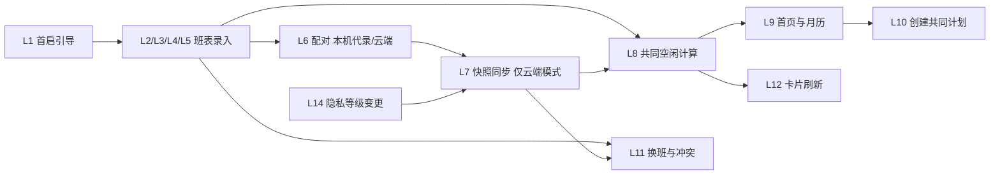
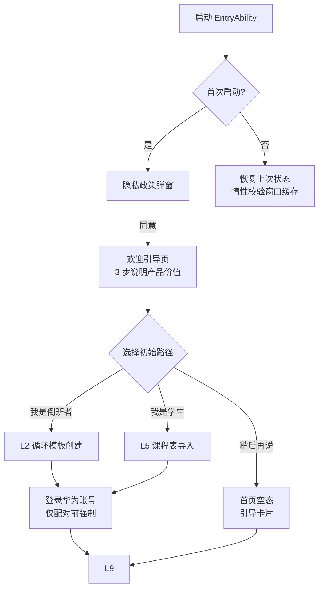
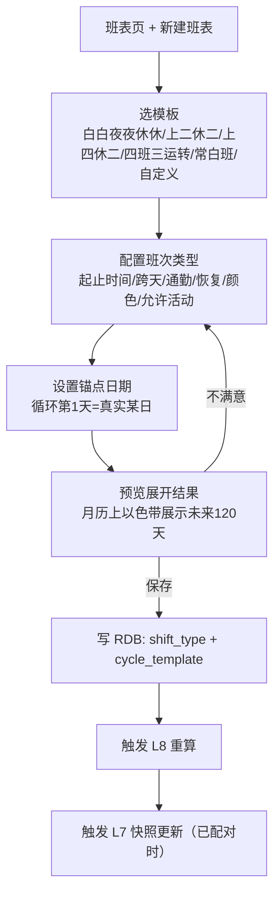
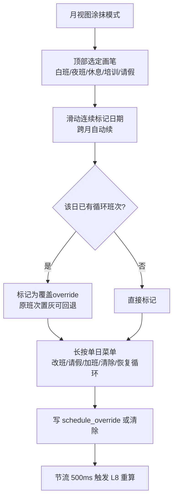
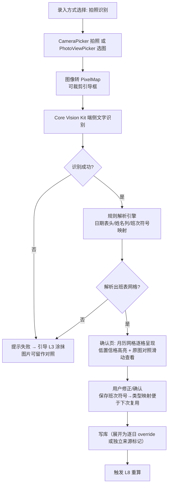
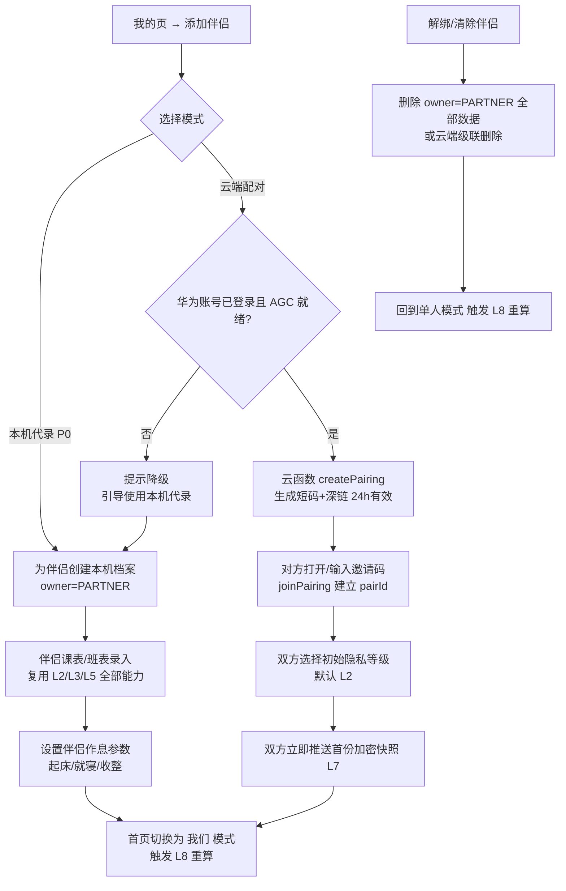
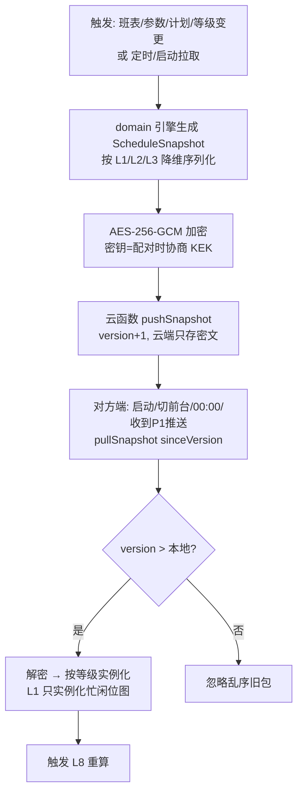
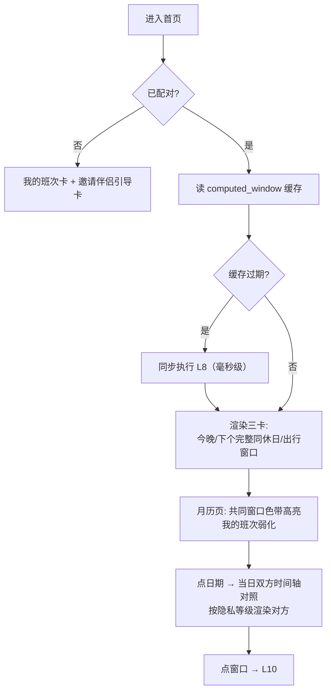
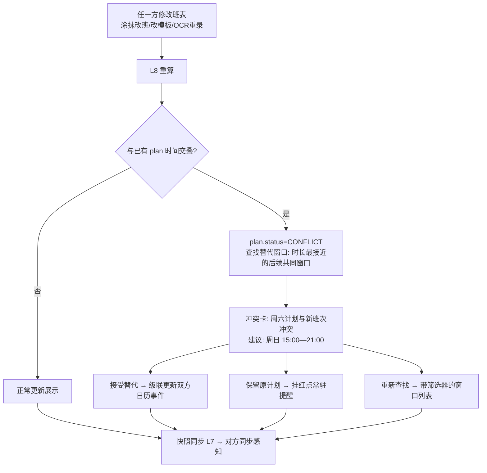
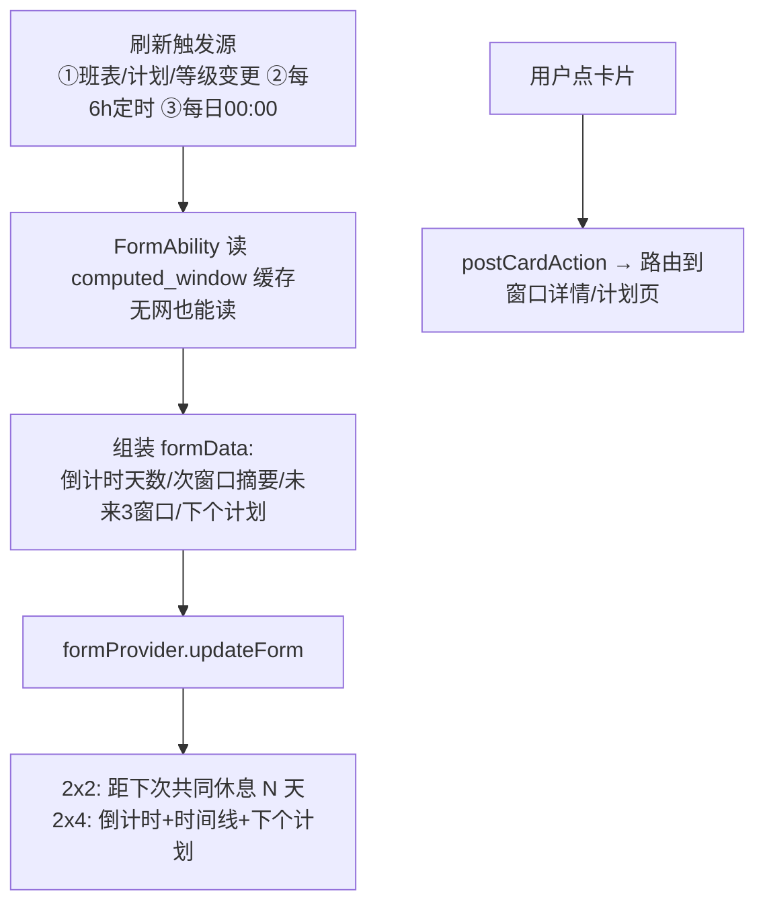

# 同休日 功能链路设计

> 与 [产品设计文档](./01-产品设计文档.md)（F1–F11 编号对应）、[技术架构设计](./02-技术架构设计.md)（模块名对应）配套阅读。
> 每条链路给出：主流程图 → 关键分支与异常 → 涉及模块。链路编号 L1–L14 可直接作为开发任务拆分与测试用例目录。
>
> **v1.1 修订**：L4（班表网格 OCR）降为 P1；L6 重构为"本机代录（P0 主路径）+ 云端配对（增强路径）"；L13（实况窗）移出首版；L8 补充本机代录装配路径；新增 L11 冲突检测的具体判定口径。

## 链路总览



---

## L1 首次启动与引导



**分支/异常**：拒绝隐私政策 → 退出 App（不可进入）；华为账号登录失败 → 可跳过（单人模式），进入配对流程时再强制。
**模块**：entryability、feature/schedule、data（首启标记）。

## L2 循环班表录入（手动循环）



**分支/异常**：锚点选错可在预览中平移循环；同名班次复用已有类型。
**模块**：feature/schedule、domain/expand、data。

## L3 日历涂抹录入



**分支/异常**：60 天以上滑动用懒加载网格；涂抹与模板共存时 override 优先，UI 上原循环班次半透明显示。
**模块**：feature/schedule（月历组件复用 cotime 的网格）、data。

## L4 拍照/截图 OCR 录入（P1，v1.1 降级）

> 首版 OCR 仅覆盖**课程表行文本**（走 L5 的 C2 分支，已实现）。班表网格解析（姓名列/班次符号映射/逐格确认页）为 P1 内容，主流程保留如下，实施时以涂抹（L3）兜底。



**分支/异常**：识别人的姓名与当前用户不匹配时提示"请框选自己的行/列"；同名多列（团队排班）支持选择姓名。
**模块**：feature/schedule/ocr、domain（解析规则）、commons（图像工具）。

## L5 大学生课程表导入

```mermaid
flowchart TD
    A[录入方式: 课程表] --> B{导入途径}
    B -- 文本粘贴 --> C1[教务系统课表文本\n正则/模板解析]
    B -- 截图/拍照 --> C2[走 L4 OCR + 课程网格解析]
    B -- 手动 --> C3[逐门添加课程]
    C1 & C2 & C3 --> D[课程列表确认\n名称/星期/节次/周次/单双周/地点]
    D --> E[设置学期锚点\n第一周周一日期]
    E --> F[配置作息模板\n节次→时间映射]
    F --> G[预览: 学期周视图\n验证单双周与周次范围]
    G -- 保存 --> H[写 course + term_config]
    H --> I[触发 L8 重算]
    I --> J[筛选器出现"共同自习"入口]
```

**分支/异常**：节次模板缺失时按"8:00 起，每节 45+10 分钟"默认生成并可改；周次超出范围不产生忙碌块；考试周整段涂抹"复习"走 L3。
**模块**：feature/schedule/course、domain/expand（课程展开器）。

## L6 配对（v1.1：本机代录 P0 主路径 + 云端配对增强路径）



**分支/异常**：短码过期/已用 → 提示重新生成；一方已有伴侣关系 → 需先解绑；AGC 未配置/无网 → 云端入口灰置并引导本机代录；解绑后本地保留只读历史（可清空）。
**模块**：feature/pair、data（owner 维度）、cloud（仅云端模式）。

## L7 快照同步（隐私分级，仅云端配对模式）



**分支/异常**：解密失败 → 标记配对异常提示重配；离线 → 入待同步队列，恢复网络补发（指数退避 3 次）。
**模块**：domain/engine（快照序列化）、cloud、data（sync_meta 版本号）。

## L8 共同空闲计算（引擎数据流）

```mermaid
flowchart TD
    A[输入① 我的班表\n模板+override+课程+计划] --> C[expand]
    B[输入② 对方快照\n忙区间(按等级)] --> D[buffer→区间归一]
    C --> D
    D --> E[merge: 双人忙区间并集→取补]
    E --> F[classify 打标\nMEAL/HALF_DAY/FULL_DAY/WEEKEND/TRIP/OVERNIGHT/STUDY]
    F --> G[写 computed_window 缓存]
    G --> H[通知 VM/卡片/冲突检查]
```

**触发时机**：L2/L3/L4/L5 保存、参数变更（通勤/恢复/作息）、L7 快照更新、L10/L11 计划变更、每日 00:00。

> v1.1：本机代录模式下，引擎装配为"我的班表（owner=ME，我的参数）+ 伴侣班表（owner=PARTNER，伴侣参数）"，两条 expand→buffer 管线分别构建忙区间后进入 merge。云端模式下伴侣忙区间来自快照解码，不二次加缓冲。

**异常**：参数非法（恢复>12h） UI 层限制；计算本身纯函数无副作用，异常即缺陷由单测兜底。
**模块**：domain 全部、data（缓存）、feature/cotime。

## L9 首页与共同月历展示



**分支/异常**：未来 90 天无任何窗口 → 空态页给"调整缓冲参数/检查班表"建议；对方 L1 时对照轴显示"对方忙"色块无文字。
**模块**：feature/cotime、data（缓存）。

## L10 创建共同计划 → 日历 → 提醒

```mermaid
flowchart TD
    A[窗口详情页\n时间轴可视化 + 时长] --> B[选计划类型\n吃饭/电影/接送孩子/回家/办事/旅行/自习/自定义]
    B --> C[命名 + 调整起止\n硬限制在窗口内]
    C --> D{首次写日历?}
    D -- 是 --> D1[弹 READ/WRITE_CALENDAR 授权]
    D1 -- 拒绝 --> D2[仅本地创建+提醒\n设置页可重授权]
    D1 -- 同意 & 拒绝后重试成功 --> E
    D -- 否 --> E[创建/获取"同休日"系统日历]
    E --> F[本机 addEvent\n含提醒时间=出发前]
    F --> G[写 plan 表 + 更新忙区间]
    G --> H[快照更新 L7\n对方端收到 → 对方也写日历]
    H --> I[本地通知授权引导\n注册出发提醒]
    I --> J[首页/卡片显示下一个共同计划]
    K[取消计划] --> L[确认弹窗 → 级联删双方日历事件\nplan.status=CANCELLED → L8 重算]
```

**分支/异常**：对方写日历失败 → 对方 App 内提醒兜底并回写状态；窗口被 L11 冲突作废 → 计划进入 CONFLICT 态。
**模块**：feature/plan、CalendarKit、NotificationKit。

## L11 换班修改 → 重算 → 冲突处理



**分支/异常**：无替代窗口 → 明示"未来 30 天无相近窗口"并给筛选入口；双方同时修改 → 以快照 version 高者为准，低者本地下一次拉取时对齐。

**冲突判定口径（v1.1 明确）**：重算时对每个状态 OK 的计划 P：构建"排除 P 自身占用"的双方忙区间并集，若 P 的区间与之交叠 >0 分钟 → P 置 CONFLICT；替代窗口 = 满足"时长 ≥ P 时长"的最近后续共同窗口（取时长最接近者）。

**模块**：domain（冲突检测）、feature/plan、cloud。

## L12 服务卡片刷新



**分支/异常**：未配对卡片显示"我的下次休息"（单人价值）；缓存缺失时卡片显示占位文案并请求一次重算。
**模块**：entryformability、widget/、domain。

## L13 实况窗（移出首版，二期）

```mermaid
flowchart TD
    A[当天存在状态 OK 的共同计划] --> B{实况窗权益已批?}
    B -- 否 --> B1[降级: 计划开始前2h发普通通知]
    B -- 是 --> C[计划前 2h 创建 LiveView\n倒计时: 距离见面还有 X 小时]
    C --> D[每分钟更新 / 阶段更新]
    D --> E[计划开始 → 文案切换"进行中"]
    E --> F[结束/取消 → 收起实况窗]
```

**分支/异常**：创建失败（权益/频率）静默降级为通知，不打断用户。
**模块**：feature/plan、LiveViewKit、NotificationKit。

## L14 隐私等级变更

```mermaid
flowchart TD
    A[设置 → 共享范围] --> B[L1 忙闲 / L2 班次类型默认 / L3 完整时间]
    B --> C[明示"改后对方可见内容"对照说明]
    C --> D[保存 Preferences → 立即触发 L7 新快照]
    D --> E[对方端按新等级重渲染\nL3→L1 后精确时间立即不可见]
```

**分支/异常**：升/降级均生成新 version 快照，无需双方确认（主动权在数据所有者）；解绑时快照删除。
**模块**：feature/pair、domain/engine、cloud。

---

## 测试用例映射

| 链路 | 必测用例（节选） |
|------|------------------|
| L2/L8 | PRD F4 示例精确复现；跨天夜班；31 天循环锚点；override 覆盖回退 |
| L4 | 20 样本集成功率 ≥85%；姓名不匹配提示 |
| L5 | 单双周×周次范围；节次模板变更全表联动 |
| L6 | 两真机邀请码/二维码配对；过期短码；重复配对拦截 |
| L7 | 三等级序列化往返；版本乱序丢弃；解密失败重配 |
| L10 | 授权拒绝降级；级联删除日历 |
| L11 | 冲突检出；替代窗口排序正确性 |
| L12 | 杀进程后卡片展示；00:00 日切刷新 |
